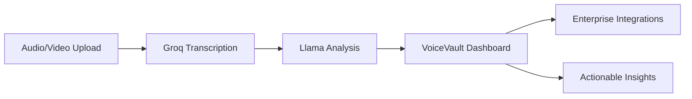
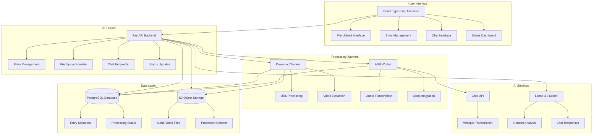
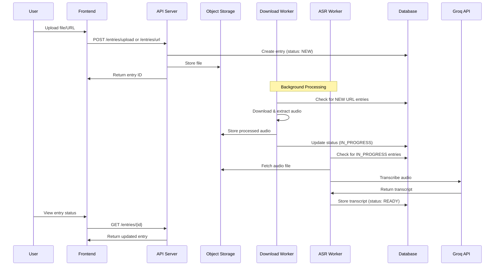
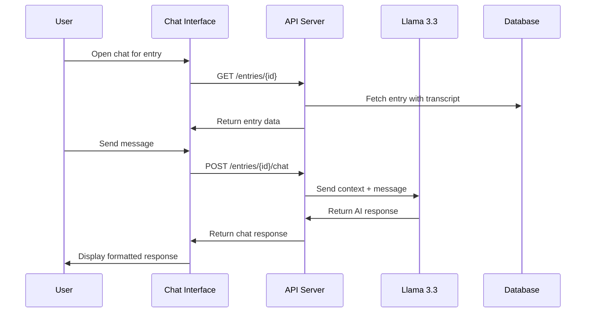

# VoiceVault 🎙️

**Enterprise voice intelligence platform for the future of work**

VoiceVault transforms voice conversations into actionable insights using cutting-edge AI/ML with enterprise-grade security. Built for hackathon submission (RAISE2025 - Vultr Track).

[](https://opensource.org/licenses/MIT)
[](https://vultr.com)
[](https://groq.com)

## 🚀 Project Overview

VoiceVault addresses the critical workflow bottleneck of manual voice conversation processing in enterprise environments. From sales calls to customer support interactions, we're creating agentic workflows that turn every conversation into a competitive advantage.

### 🎯 Problem Statement
- **Manual Processing**: 73% of business calls require manual note-taking and follow-up
- **Lost Insights**: Critical conversation details are forgotten or misinterpreted
- **Workflow Delays**: Average 2-3 hours between call completion and actionable insights
- **Scaling Issues**: Human-dependent processes don't scale with business growth

### 💡 Our Solution
VoiceVault provides **automated, intelligent voice conversation processing** with:
- **Real-time transcription** using Groq's lightning-fast inference
- **Context-aware analysis** powered by Llama 3.3 models
- **Actionable insights** extracted automatically from conversations
- **Enterprise integrations** for seamless workflow automation

### Core Workflow


### Key Features
- ⚡ **Lightning Fast**: Sub-second transcription with Groq API
- 🧠 **Intelligent Analysis**: Context-aware summarization using Llama 3.3
- 🏢 **Enterprise Ready**: Secure, scalable, and integration-friendly
- 🤖 **Agentic Workflows**: Automated routing, action items, and follow-ups
- 📱 **Multi-format Support**: Audio, video files, and URL imports
- 💬 **Interactive Chat**: Query transcripts with natural language
- 🔒 **Secure Storage**: Enterprise-grade data protection

## 🏗️ Architecture

### System Overview



### Component Details

#### 🌐 Frontend Service (`/ui`)
- **Framework**: React 18 + TypeScript + Vite
- **Styling**: Tailwind CSS with responsive design
- **Features**:
  - Drag & drop file upload with progress tracking
  - Real-time entry status updates (auto-refresh)
  - Interactive chat interface with markdown support
  - Entry management with delete functionality
  - Mobile-responsive enterprise design

#### ⚡ API Service (`/api`)
- **Framework**: FastAPI with async support and automatic documentation
- **Database**: PostgreSQL with SQLAlchemy ORM
- **Storage**: S3-compatible object storage integration
- **Features**:
  - RESTful API with OpenAPI/Swagger documentation
  - File upload handling (500MB max, multiple formats)
  - Entry lifecycle management (NEW → IN_PROGRESS → READY → COMPLETE)
  - Chat endpoints with conversation history
  - Automatic database migrations on startup

#### 🔄 Processing Workers (`/worker`)
- **Download Worker**: Handles URL-based content extraction
  - YouTube, Vimeo, SoundCloud support via yt-dlp
  - Video-to-audio extraction with FFmpeg
  - S3 upload and metadata tracking
- **ASR Worker**: Manages transcription pipeline
  - Groq Whisper integration for fast transcription
  - Multi-format audio support (mp3, wav, m4a, etc.)
  - Error handling and retry logic

#### 🤖 AI Integration
- **Groq API**: Lightning-fast transcription
  - Model: `whisper-large-v3-turbo`
  - Sub-second processing for most audio files
  - High accuracy with multi-language support
- **Llama 3.3**: Intelligent content analysis
  - Model: `llama-3.3-70b-versatile`
  - Context-aware summarization
  - Interactive chat with conversation memory

#### 💾 Data Storage
- **PostgreSQL Database**: Entry metadata and status tracking
  - Automatic table creation on startup
  - Support for external managed databases
- **S3 Object Storage**: File storage and management
  - Support for any S3-compatible provider
  - Scalable storage for audio/video content

## 🔄 Processing Workflows

### File Upload Workflow


### Chat Interaction Workflow


## 📋 API Endpoints

### Entry Management
- **POST** `/api/entries/upload` - Upload audio/video file (multipart/form-data)
  - **Request**: File upload with optional metadata
  - **Response**: Entry object with ID and initial status
- **POST** `/api/entries/url` - Create entry from URL
  - **Request**: `{"url": "https://example.com/video.mp4"}`
  - **Response**: Entry object for URL-based processing
- **GET** `/api/entries/` - List all entries (paginated, newest first)
  - **Response**: Array of entry objects with metadata
- **GET** `/api/entries/{id}` - Get specific entry with full details
  - **Response**: Complete entry object including transcript if available
- **PUT** `/api/entries/{id}/status` - Update entry processing status
  - **Request**: `{"status": "COMPLETE"}`
  - **Response**: Updated entry object
- **DELETE** `/api/entries/{id}` - Delete entry and associated files
  - **Response**: Deletion confirmation

### Chat & Analysis
- **POST** `/api/entries/{id}/chat` - Interactive chat with entry transcript
  - **Request**: `{"message": "What are the key points discussed?"}`
  - **Response**: AI-generated response with conversation context
- **POST** `/api/entries/{id}/summary` - Generate AI summary (planned)
  - **Request**: Optional summary type and length parameters
  - **Response**: Structured summary with key insights

### System
- **GET** `/api/` - API status and version information
- **GET** `/api/health` - Health check endpoint for monitoring
- **GET** `/api/docs` - Interactive OpenAPI documentation (Swagger UI)
- **GET** `/api/redoc` - Alternative API documentation (ReDoc)

## 🛠️ Setup & Installation

### Prerequisites
- Docker and Docker Compose
- Git

### Quick Start

1. **Clone the repository**
   ```bash
   git clone https://github.com/your-username/voicevault.git
   cd voicevault
   ```

2. **Configure environment**
   ```bash
   cp .env.example .env
   # Edit .env with your configuration
   ```

3. **Start services**
   ```bash
   docker compose up --build
   ```

4. **Run database migrations**
   ```bash
   # In a new terminal
   cd api
   docker compose exec api alembic upgrade head
   ```

5. **Access the API**
   - API: http://localhost:8000
   - Documentation: http://localhost:8000/docs
   - Database: localhost:5432

### Environment Configuration

#### Required Variables
```env
# Database
POSTGRES_HOST=your_database_host  # For production (e.g., managed database)
POSTGRES_PORT=5432
POSTGRES_DB=voicevault
POSTGRES_USER=voicevault_user
POSTGRES_PASSWORD=your_secure_password

# API Keys (for production)
GROQ_API_KEY=your_groq_api_key_here
HUGGINGFACE_TOKEN=your_huggingface_token_here
```

#### S3 Storage Configuration

**Production (S3-Compatible Storage)**
```env
# Vultr Object Storage
S3_ENDPOINT_URL=https://ewr1.vultrobjects.com
S3_ACCESS_KEY=your_s3_access_key
S3_SECRET_KEY=your_s3_secret_key
S3_BUCKET_NAME=voicevault-prod

# AWS S3 (alternative)
# S3_ENDPOINT_URL=https://s3.amazonaws.com
# S3_ACCESS_KEY=your_aws_access_key
# S3_SECRET_KEY=your_aws_secret_key
```

**Local Development (MinIO)**
```env
S3_ENDPOINT_URL=http://minio:9000
S3_ACCESS_KEY=minioadmin
S3_SECRET_KEY=minioadmin
S3_BUCKET_NAME=voicevault
```

#### Container Registry Configuration
```env
# Leave empty for local builds
REGISTRY=
VERSION=latest

# For Vultr Container Registry
REGISTRY=https://fra.vultrcr.com/raise2025/
VERSION=v1.0.0
```

#### Optional Variables
```env
# Ports
API_PORT=8000
POSTGRES_PORT=5432

# File Storage
UPLOAD_DIR=uploads
MAX_FILE_SIZE=524288000  # 500MB

# Processing
PROCESSING_TIMEOUT=3600  # 1 hour
```

## 🚀 Deployment

### Local Development
```bash
# Clone repository
git clone https://github.com/your-username/voicevault.git
cd voicevault

# Configure environment for local development
cp .env.example .env
# Edit .env with your API keys

# Start all services
docker compose up --build

# Access services
# - Frontend: http://localhost:3000
# - API: http://localhost:8000
# - API Docs: http://localhost:8000/docs
# - Database: localhost:5432
# - MinIO: http://localhost:9001
```

### Production Deployment

#### Option 1: Vultr Compute Instance (Recommended for Hackathon)

**Simple Production Deployment:**
```bash
# 1. Create Vultr Compute Instance
# - Ubuntu 22.04 LTS
# - 2 vCPUs, 4GB RAM minimum
# - Docker pre-installed

# 2. Clone repository
git clone https://github.com/your-username/voicevault.git
cd voicevault

# 3. Configure environment
cp .env.example .env
nano .env  # Add your production credentials

# 4. Build and deploy production containers
docker compose -f compose.prod.yml up -d --build

# 5. Check deployment
docker compose -f compose.prod.yml ps
curl http://your-server-ip:8000/health
```

**Using Container Registry:**
```bash
# 1. Build and push to registry
export REGISTRY=fra.vultrcr.com/raise2025/
export VERSION=v1.0.0

docker compose -f compose.prod.yml build
docker compose -f compose.prod.yml push

# 2. On production server
docker compose -f compose.prod.yml pull
docker compose -f compose.prod.yml up -d
```

#### Production Build Features
- **Self-Contained Containers**: All code embedded in images (no volume mounts)
- **Simple Deployment**: Single compose file for production
- **External Services**: Designed for managed databases and S3 storage
- **Container Registry Support**: Easy push/pull workflow

### Environment Configuration

#### Production Environment Variables
```bash
# Database (Vultr Managed Database)
POSTGRES_HOST=your-vultr-db-host.vultrdb.com
POSTGRES_PORT=5432
POSTGRES_DB=voicevault
POSTGRES_USER=voicevault_user
POSTGRES_PASSWORD=your_secure_password

# S3 Storage (Vultr Object Storage)
S3_ENDPOINT_URL=https://ewr1.vultrobjects.com
S3_ACCESS_KEY=your_s3_access_key
S3_SECRET_KEY=your_s3_secret_key
S3_BUCKET_NAME=voicevault-prod

# API Keys
GROQ_API_KEY=your_groq_api_key
HUGGINGFACE_TOKEN=your_huggingface_token

# Container Registry
REGISTRY=fra.vultrcr.com/raise2025/
VERSION=v1.0.0
```

## 🎯 Hackathon Requirements (RAISE2025 - Vultr Track)

### ✅ Implemented Features
- **Enterprise Voice Platform**: Complete web application for voice intelligence
- **Groq Integration**: Fast transcription using Whisper-large-v3-turbo
- **Llama 3.3 Integration**: Intelligent conversation analysis and chat
- **React Frontend**: Professional enterprise dashboard with file upload
- **FastAPI Backend**: Production-ready API with async processing
- **PostgreSQL Database**: Vultr-compatible database with automatic migrations
- **S3 Storage**: Scalable file storage (Vultr Object Storage ready)
- **Docker Containerization**: Multi-service architecture with worker processing
- **Background Processing**: Async ASR pipeline with status tracking
- **Interactive Chat**: Query transcripts with natural language using Llama 3.3

### 🔄 Current Status
- **Vultr Deployment**: Ready for production deployment
- **Agentic Workflows**: Foundation in place for automated processing
- **Enterprise Features**: Core functionality complete

### 📋 Next Steps for Competition
1. **Deploy to Vultr Infrastructure**
   - Set up Vultr Compute instance or Kubernetes cluster
   - Configure Vultr Managed Database
   - Set up Vultr Object Storage
2. **Demonstrate Agentic Workflows**
   - Automated call classification
   - Smart routing based on content
   - Action item extraction from conversations
3. **Enterprise Integration Demo**
   - CRM webhook integration
   - Slack notification system
   - Email summary distribution

## 🎨 Technology Stack

### Backend
- **FastAPI**: High-performance async web framework
- **SQLAlchemy**: ORM with PostgreSQL support
- **Alembic**: Database migration management
- **Pydantic**: Data validation and serialization
- **Groq**: Fast AI inference for transcription
- **Transformers**: Hugging Face for Llama models

### Database
- **PostgreSQL 17**: Production-ready relational database
- **pgAdmin**: Database administration (optional)

### Infrastructure
- **Docker**: Containerization
- **Docker Compose**: Multi-service orchestration
- **Vultr**: Cloud deployment platform
- **Nginx**: Reverse proxy and load balancer (planned)

### Frontend (Planned)
- **React**: Modern UI framework
- **TypeScript**: Type-safe development
- **Tailwind CSS**: Utility-first styling
- **Axios**: HTTP client for API communication

## 📊 Entry Status Workflow

```
NEW → IN_PROGRESS → READY → COMPLETE
 ↓         ↓          ↓         ↓
Upload   ASR       LLM       User
       Running   Analysis   Marked
```

- **NEW**: Just uploaded, queued for processing
- **IN_PROGRESS**: ASR (Automatic Speech Recognition) running
- **READY**: Transcript ready, available for LLM interaction
- **COMPLETE**: Processing finished, marked complete by user

## 🔧 Development

### Project Structure
```
voicevault/
├── api/                    # FastAPI backend
│   ├── app/               # Application code
│   │   ├── api/          # API routes
│   │   ├── core/         # Configuration
│   │   ├── db/           # Database setup
│   │   ├── models/       # Data models
│   │   └── services/     # Business logic
│   ├── alembic/          # Database migrations
│   ├── requirements.txt  # Python dependencies
│   └── Dockerfile       # Container definition
├── ui/                    # React frontend (planned)
├── docs/                  # Project documentation
├── compose.yml           # Docker Compose configuration
├── .env.example          # Environment template
└── README.md            # This file
```

### Production Commands

#### Build and Deploy
```bash
# Build and start all production containers
docker compose -f compose.prod.yml up -d --build

# Build only (without starting)
docker compose -f compose.prod.yml build

# Push to registry
docker compose -f compose.prod.yml push

# Pull from registry
docker compose -f compose.prod.yml pull
```

#### Management
```bash
# View running services
docker compose -f compose.prod.yml ps

# View logs
docker compose -f compose.prod.yml logs -f

# Stop services
docker compose -f compose.prod.yml down

# Clean up
docker compose -f compose.prod.yml down --volumes --remove-orphans
```

### Running Tests
```bash
# Backend tests
cd api
python -m pytest

# Integration tests
docker compose run api python -m pytest tests/

# Using make
make test
```

### Database Operations
```bash
# Create new migration
cd api
alembic revision --autogenerate -m "Description"

# Apply migrations
alembic upgrade head

# Rollback migration
alembic downgrade -1
```

## 🐛 Troubleshooting

### Common Issues

#### Database Connection Errors
```bash
# Check database connectivity
docker compose exec api python -c "from app.db.database import engine; print(engine.url)"

# Verify database tables
docker compose exec db psql -U voicevault_user -d voicevault -c "\dt"
```

#### Worker Processing Issues
```bash
# Check worker logs
docker compose logs -f worker-download
docker compose logs -f worker-asr

# Verify S3 connectivity
docker compose exec api python -c "from app.core.config import settings; print(settings.s3_endpoint_url)"
```

#### File Upload Problems
```bash
# Check nginx configuration
docker compose exec ui cat /etc/nginx/conf.d/default.conf

# Verify file size limits
curl -X POST -F "file=@large_file.mp4" http://localhost:8000/api/entries/upload
```

### Performance Optimization
- **Database**: Use connection pooling and async queries
- **File Storage**: Implement multipart uploads for large files
- **Worker Processing**: Scale workers based on queue depth
- **Caching**: Add Redis for session management and API caching

### Monitoring
```bash
# Check service health
curl http://localhost:8000/health

# Monitor resource usage
docker compose top
docker stats
```

## 📈 Roadmap

### Phase 1: Core MVP ✅
- [x] FastAPI backend with PostgreSQL and automatic migrations
- [x] Docker containerization with multi-service architecture
- [x] File upload system with S3 storage integration
- [x] Entry management API with full CRUD operations
- [x] Background worker processing pipeline
- [x] Database migrations and external database support

### Phase 2: AI Integration ✅
- [x] Groq API integration for fast transcription (Whisper-large-v3-turbo)
- [x] Llama 3.3 integration for intelligent conversation analysis
- [x] Background processing pipeline with status tracking
- [x] Error handling and retry logic for ASR processing
- [x] Interactive chat interface with conversation context

### Phase 3: Frontend & UX ✅
- [x] React TypeScript frontend with Vite
- [x] Enterprise dashboard UI with Tailwind CSS
- [x] File upload interface with drag-and-drop
- [x] Real-time status updates and entry management
- [x] Interactive chat interface with markdown support
- [x] Mobile-responsive design

### Phase 4: Enterprise Features 🔄
- [x] S3-compatible storage for any provider
- [x] External database support for managed services
- [x] Container registry integration for production
- [x] Comprehensive API documentation
- [ ] User authentication and team management
- [ ] CRM webhook integrations
- [ ] Slack/Teams notification system
- [ ] Advanced analytics and reporting dashboard

### Phase 5: Agentic Workflows 📋
- [x] Foundation for automated processing workflows
- [x] Intelligent conversation analysis with context
- [ ] Automated call classification and routing
- [ ] Action item extraction from conversations
- [ ] Follow-up scheduling and reminders
- [ ] Sentiment analysis and escalation triggers
- [ ] Integration with enterprise workflow systems

## 🏆 Success Metrics

### Technical
- **Processing Speed**: Real-time transcription, <30s summarization
- **Accuracy**: >95% transcription accuracy
- **Scalability**: Handle 100+ concurrent uploads
- **Reliability**: 99.9% uptime

### Business
- **Enterprise Adoption**: Active team usage
- **Time Savings**: Quantifiable documentation reduction
- **Integration Success**: Seamless CRM/tool integration
- **Customer Satisfaction**: Positive feedback on summary quality

## 🤝 Contributing

This is a hackathon project for RAISE2025. Development is currently focused on meeting hackathon requirements and demonstrating enterprise voice intelligence capabilities.

### Development Guidelines
1. Follow existing code patterns
2. Add tests for new features
3. Update documentation
4. Use conventional commits

## 📄 License

This project is licensed under the MIT License - see the LICENSE file for details.

## 🎯 Hackathon Context

**RAISE2025 - Vultr Track: Agentic Workflows for the Future of Work**

Building a web-based enterprise agent that transforms voice conversations into actionable insights, deployed on Vultr infrastructure and optimized for real-world business use cases.

---

*VoiceVault - Transforming Enterprise Conversations into Competitive Advantage*