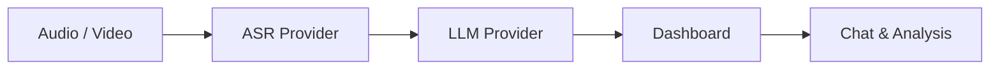

# VoiceVault

**Voice intelligence platform — transcribe, analyse, and chat with your voice conversations.**

[](https://opensource.org/licenses/MIT)

Started as a hackathon project, now developed as an open platform.

## Demo

https://github.com/your-username/voicevault/raw/main/screencast.mp4

## How It Works

Upload an audio or video file (or submit a URL), and VoiceVault queues it for transcription via your configured ASR provider. Once the transcript is ready, an LLM provider analyses the content and makes it available for interactive chat and summarisation — all from a clean dashboard.


```mermaid
graph LR
    A[Audio / Video] --> B[ASR Provider]
    B --> C[LLM Provider]
    C --> D[Dashboard]
    D --> E[Chat & Analysis]
```

→ [Full architecture and diagrams](docs/architecture.md)

## Features

- Multi-format input: audio files, video files, and URLs (YouTube, Vimeo, SoundCloud, direct links)
- Pluggable ASR provider: Groq (Whisper), self-hosted Whisper
- Pluggable LLM provider: Groq, Cerebras, Ollama, Nebius
- Interactive chat — ask questions about any transcript in natural language
- AI summarisation of conversations and meetings
- Prompt template management for consistent LLM behaviour
- Background processing pipeline with real-time status tracking
- S3-compatible storage — works with any provider or local MinIO
- Optional Bearer token authentication

## Quick Start

**Prerequisites:** Docker, Docker Compose, Git

```bash
git clone https://github.com/your-username/voicevault.git
cd voicevault
cp .env.example .env
# Edit .env — at minimum set GROQ_API_KEY (or configure an alternative provider)
docker compose up --build
```

| Service | URL |
|---------|-----|
| Frontend | http://localhost:3000 |
| API | http://localhost:8000 |
| API docs | http://localhost:8000/docs |
| MinIO console | http://localhost:9001 |

→ [Production deployment](docs/deployment.md)

## Configuration

Both ASR and LLM providers are pluggable — choose what fits your setup. Provider-specific API keys are listed in [docs/configuration.md](docs/configuration.md).

| Variable | Default | Description |
|----------|---------|-------------|
| `ASR_PROVIDER` | `groq` | ASR backend: `groq` or `whisper_asr` |
| `ASR_MODEL` | `whisper-large-v3-turbo` | Model (Groq only) |
| `LLM_PROVIDER` | `groq` | LLM backend: `groq`, `cerebras`, `ollama`, or `nebius` |
| `LLM_MODEL` | `llama-3.3-70b-versatile` | Model name |
| `ACCESS_TOKEN` | _(empty)_ | Bearer token for API auth — leave empty to disable |
| `S3_ENDPOINT_URL` | — | S3-compatible endpoint (MinIO, AWS, DigitalOcean, …) |
| `S3_ACCESS_KEY` | — | S3 access key |
| `S3_SECRET_KEY` | — | S3 secret key |

→ [Full configuration reference](docs/configuration.md) · [`.env.example`](.env.example)

## API

| Group | Endpoints |
|-------|-----------|
| Entries | upload file, submit URL, create from transcript, list, get, update status, archive, delete |
| Chat & Analysis | chat with transcript, generate summary |
| Prompt Templates | list, create, update, delete |
| System | health check, API info |

→ [Full API reference](docs/api.md) · [Interactive docs](http://localhost:8000/docs)

## Tech Stack

| Layer | Technology |
|-------|-----------|
| Frontend | React 18 + TypeScript + Vite + Tailwind CSS |
| Backend | FastAPI + SQLAlchemy + PostgreSQL |
| Workers | Python + yt-dlp + FFmpeg |
| ASR Providers | Groq (Whisper), self-hosted Whisper |
| LLM Providers | Groq, Cerebras, Ollama, Nebius |
| Storage | PostgreSQL 17, S3-compatible object storage |
| Infrastructure | Docker Compose |

## Contributing

Follow existing code patterns and use conventional commits. Open issues and pull requests via GitHub.

## License

MIT — see [LICENSE](LICENSE).
