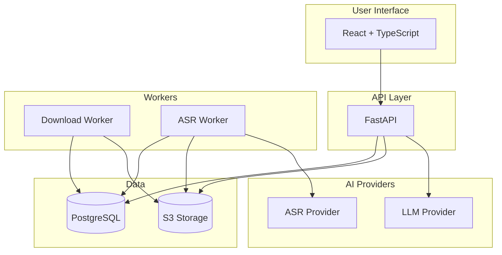
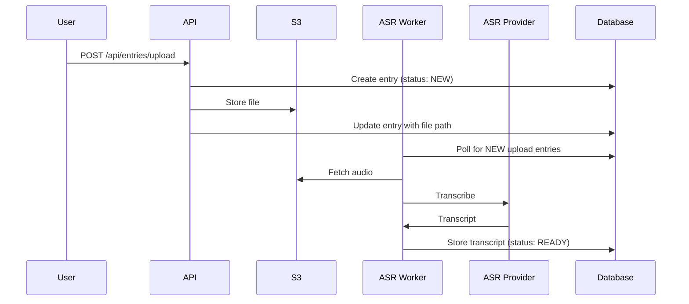
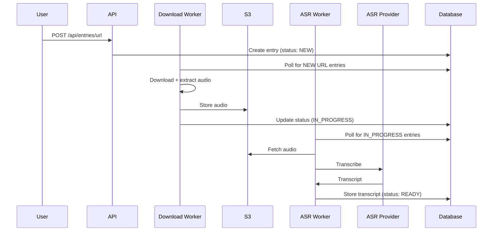

# Architecture

VoiceVault is a multi-service application composed of five containerised services.

## System Overview



## Services

### UI (`/ui`)
React 18 + TypeScript + Vite frontend served by Nginx on port 3000. Provides drag-and-drop file upload, real-time entry status, interactive chat, and prompt template management.

### API (`/api`)
FastAPI backend on port 8000. Handles entry CRUD, file uploads, chat, prompt templates, and optional Bearer token authentication. Database tables are created automatically on startup via `Base.metadata.create_all()` — no manual migrations needed for development.

### Download Worker (`/worker`, `WORKER_MODE=download`)
Polls for entries with `entry_type=url` and `status=NEW`. Downloads audio/video via yt-dlp, extracts audio with FFmpeg, uploads to S3, and advances status to `IN_PROGRESS`.

### ASR Worker (`/worker`, `WORKER_MODE=asr`)
Polls for entries with `status=IN_PROGRESS`. Fetches audio from S3, transcribes via the configured ASR provider, stores the transcript, and advances status to `READY`.

### Database
PostgreSQL 17. Stores entry metadata, transcripts, chat history, and prompt templates.

### Object Storage
Any S3-compatible provider. Stores original uploads and processed audio files. MinIO is used locally via Docker Compose.

## Entry Status Workflow

```
NEW → IN_PROGRESS → READY → COMPLETE
          ↓
        ERROR
```

- **NEW** — entry created (file uploaded or URL submitted)
- **IN_PROGRESS** — audio downloaded and stored, queued for ASR
- **READY** — transcript available, entry can be chatted with
- **COMPLETE** — user has marked the entry as finished
- **ERROR** — processing failed; the `error_message` field contains details

## Processing Sequence

### File upload


### URL submission


## Project Structure

```
voicevault/
├── api/                    # FastAPI backend
│   ├── app/
│   │   ├── api/routes/     # Endpoints (entries, prompt_templates, auth)
│   │   ├── core/           # Config, authentication
│   │   ├── db/             # Database connection
│   │   ├── models/         # SQLAlchemy models + Pydantic schemas
│   │   │   ├── entry.py
│   │   │   └── prompt_template.py
│   │   └── services/       # Business logic
│   │       ├── entry_service.py
│   │       ├── chat_service.py
│   │       ├── prompt_template_service.py
│   │       └── s3_service.py
│   ├── alembic/            # Database migrations
│   └── requirements.txt
├── ui/                     # React frontend
│   └── src/
│       ├── components/
│       ├── services/       # API client
│       └── types/
├── worker/                 # Shared worker codebase
│   └── app/
│       ├── services/       # download, asr, audio conversion, S3
│       └── models/
├── docs/                   # Documentation
├── compose.yml             # Local development
├── compose.prod.yml        # Production
└── .env.example            # Environment template
```
