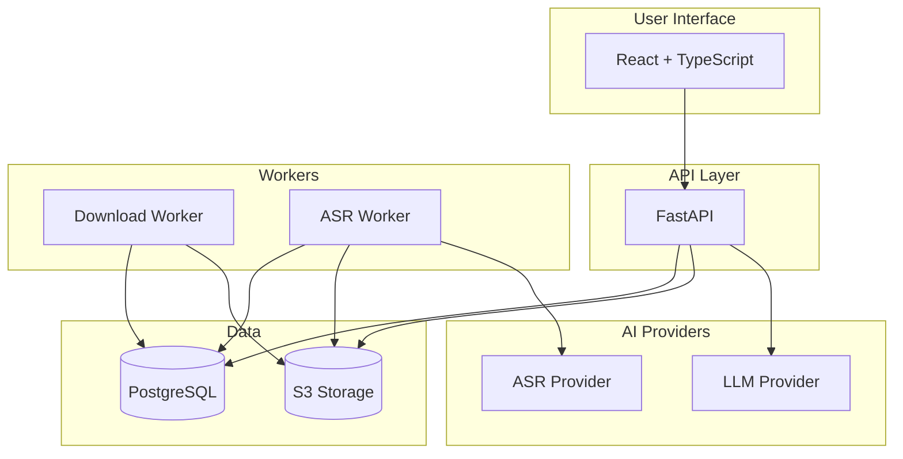
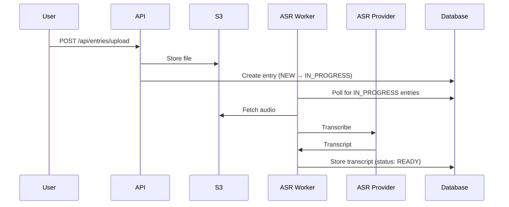
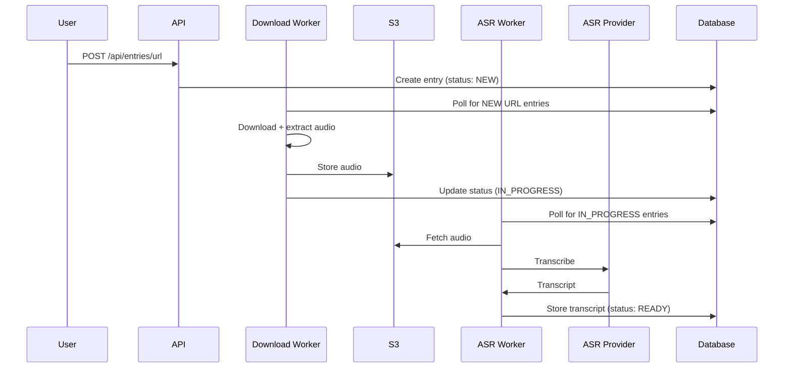
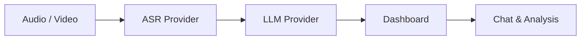

# README Redesign Implementation Plan

> **For agentic workers:** REQUIRED: Use superpowers:subagent-driven-development (if subagents available) or superpowers:executing-plans to implement this plan. Steps use checkbox (`- [ ]`) syntax for tracking.

**Goal:** Rewrite README.md into a clean, provider-agnostic open-source project README, move detailed content into dedicated docs files, and remove all hackathon/Vultr branding.

**Architecture:** README becomes a thin, navigable overview (header → demo → how it works → features → quick start → config → API → stack → contributing). All detailed content lives in four new docs files referenced from the README. No code changes — documentation only.

**Tech Stack:** Markdown, Mermaid diagrams, GitHub-native video embed.

**Spec:** `docs/superpowers/specs/2026-04-09-readme-redesign-design.md`

---

## Files touched

| Action | Path |
|--------|------|
| Create | `docs/architecture.md` |
| Create | `docs/api.md` |
| Create | `docs/configuration.md` |
| Create | `docs/deployment.md` |
| Rewrite | `README.md` |
| Modify | `.env.example` — remove `HUGGINGFACE_TOKEN`, reorder Vultr S3 comment |
| Modify | `api/.env.example` — remove `HUGGINGFACE_TOKEN` |
| Modify | `compose.yml` — remove `HUGGINGFACE_TOKEN` env var line |
| Modify | `compose.prod.yml` — remove `HUGGINGFACE_TOKEN` env var line |
| Modify | `.env.local.example` — remove `HUGGINGFACE_TOKEN` |
| Modify | `.env.production` — remove `HUGGINGFACE_TOKEN` |

---

## Chunk 1: Supporting docs

### Task 1: Create docs/architecture.md

**Files:**
- Create: `docs/architecture.md`

- [ ] **Step 1: Write docs/architecture.md**

```markdown
# Architecture

VoiceVault is a multi-service application composed of five containerised services.

## System Overview



## Services

### UI (`/ui`)
React 18 + TypeScript + Vite frontend served by Nginx on port 3000. Provides drag-and-drop file upload, real-time entry status, interactive chat, and prompt template management.

### API (`/api`)
FastAPI backend on port 8000. Handles entry CRUD, file uploads, chat, prompt templates, and optional Bearer token authentication. Database tables are created automatically on startup via `Base.metadata.create_all()` — no manual migrations needed for development.

### Download Worker (`/worker`, `WORKER_MODE=download`)
Polls for entries with `entry_type=url` and `status=NEW`. Downloads audio/video via yt-dlp, extracts audio with FFmpeg, uploads to S3, and advances status to `IN_PROGRESS`.

### ASR Worker (`/worker`, `WORKER_MODE=asr`)
Polls for entries with `status=IN_PROGRESS`. Fetches audio from S3, transcribes via the configured ASR provider, stores the transcript, and advances status to `READY`.

### Database
PostgreSQL 17. Stores entry metadata, transcripts, chat history, and prompt templates.

### Object Storage
Any S3-compatible provider. Stores original uploads and processed audio files. MinIO is used locally via Docker Compose.

## Entry Status Workflow

```
NEW → IN_PROGRESS → READY → COMPLETE
 ↑         ↑           ↑        ↑
Upload   Audio      Transcript  User
created  processed   stored    marks done
```

- **NEW** — entry created (file uploaded or URL submitted)
- **IN_PROGRESS** — audio downloaded and stored, queued for ASR
- **READY** — transcript available, entry can be chatted with
- **COMPLETE** — user has marked the entry as finished

## Processing Sequence

### File upload


### URL submission


## Project Structure

```
voicevault/
├── api/                    # FastAPI backend
│   ├── app/
│   │   ├── api/routes/     # Endpoints (entries, prompt_templates, auth)
│   │   ├── core/           # Config, authentication
│   │   ├── db/             # Database connection
│   │   ├── models/         # SQLAlchemy models + Pydantic schemas
│   │   └── services/       # Business logic
│   ├── alembic/            # Database migrations
│   └── requirements.txt
├── ui/                     # React frontend
│   └── src/
│       ├── components/
│       ├── services/       # API client
│       └── types/
├── worker/                 # Shared worker codebase
│   └── app/
│       ├── services/       # download, asr, audio conversion, S3
│       └── models/
├── docs/                   # Documentation
├── compose.yml             # Local development
├── compose.prod.yml        # Production
└── .env.example            # Environment template
```
```

- [ ] **Step 2: Verify the file renders correctly (spot-check headings and mermaid blocks)**

---

### Task 2: Create docs/api.md

**Files:**
- Create: `docs/api.md`

- [ ] **Step 1: Write docs/api.md**

```markdown
# API Reference

Base URL: `http://localhost:8000` (development)

Interactive documentation is available at `/api/docs` (Swagger UI) and `/api/redoc`.

## Authentication

Authentication is optional. When `ACCESS_TOKEN` is set, all API requests must include:

```
Authorization: Bearer <token>
```

See [docs/authentication.md](authentication.md) for details.

## Entries

### Upload a file
`POST /api/entries/upload`

Multipart form upload. Accepts audio and video files.

**Request:** `multipart/form-data` with `title` (string, required) and `file` fields.

**Response:** Entry object with `id` and `status: IN_PROGRESS`.

---

### Submit a URL
`POST /api/entries/url`

Submit a URL for download and transcription (YouTube, Vimeo, SoundCloud, direct links).

**Request:**
```json
{ "title": "My Recording", "source_url": "https://example.com/audio.mp3" }
```

**Response:** Entry object with `status: NEW`.

---

### List entries
`GET /api/entries/`

Returns all entries, newest first.

**Query params:** `page` (default 1), `per_page` (default 12), `search` (optional), `archived` (default false).

**Response:** Array of entry objects.

---

### Get entry
`GET /api/entries/{id}`

Returns a single entry including transcript if available.

---

### Update status
`PUT /api/entries/{id}/status`

**Request:**
```json
{ "status": "COMPLETE" }
```

Valid statuses: `NEW`, `IN_PROGRESS`, `READY`, `COMPLETE`.

---

### Create from transcript
`POST /api/entries/transcript`

Create an entry directly from an existing transcript (no audio processing required).

**Request:**
```json
{ "title": "My Meeting", "transcript": "Full transcript text here..." }
```

**Response:** Entry object with `status: READY`.

---

### Archive / unarchive
`PUT /api/entries/{id}/archive`

**Request:**
```json
{ "archived": true }
```

Archived entries are hidden from the default list view.

---

### Delete entry
`DELETE /api/entries/{id}`

Deletes the entry and its associated S3 files.

---

## Chat & Analysis

### Chat with a transcript
`POST /api/entries/{id}/chat`

Send a message and receive an AI response in the context of the entry's transcript.

**Request:**
```json
{ "message": "What were the key decisions made?" }
```

**Response:**
```json
{ "response": "..." }
```

---

### Generate a summary
`POST /api/entries/{id}/summary`

Generate an AI summary of the entry transcript.

**Response:**
```json
{ "summary": "..." }
```

---

## Prompt Templates

Prompt templates are reusable system-prompt snippets for customising LLM behaviour.

### List templates
`GET /api/prompt-templates/`

Query param: `active_only=true` to filter inactive templates.

---

### Create template
`POST /api/prompt-templates/`

**Request:**
```json
{
  "name": "Meeting Summary",
  "content": "Extract action items and decisions from this meeting transcript.",
  "is_active": true
}
```

---

### Update template
`PUT /api/prompt-templates/{template_id}`

Partial update — include only the fields to change.

---

### Delete template
`DELETE /api/prompt-templates/{template_id}`

---

## System

### Health check
`GET /api/health`

Returns `200 OK` when the service is running.

### API info
`GET /api/`

Returns API version and status.
```

- [ ] **Step 2: Spot-check that all endpoint groups are present (Entries, Chat, Prompt Templates, System)**

---

### Task 3: Create docs/configuration.md

**Files:**
- Create: `docs/configuration.md`

- [ ] **Step 1: Write docs/configuration.md**

```markdown
# Configuration Reference

Copy `.env.example` to `.env` and edit the values. All configuration is via environment variables.

## Database

| Variable | Default | Description |
|----------|---------|-------------|
| `POSTGRES_HOST` | `db` | Database host (`db` for Docker Compose, external host for production) |
| `POSTGRES_PORT` | `5432` | Database port |
| `POSTGRES_DB` | `voicevault` | Database name |
| `POSTGRES_USER` | — | Database user |
| `POSTGRES_PASSWORD` | — | Database password |

## API

| Variable | Default | Description |
|----------|---------|-------------|
| `API_PORT` | `8000` | API server port |
| `ACCESS_TOKEN` | _(empty)_ | Bearer token for API auth. Leave empty to disable authentication. See [authentication.md](authentication.md). |

## ASR Provider

| Variable | Default | Description |
|----------|---------|-------------|
| `ASR_PROVIDER` | `groq` | ASR backend: `groq` or `whisper_asr` |
| `ASR_MODEL` | `whisper-large-v3-turbo` | Model name (Groq only). Options: `whisper-large-v3`, `whisper-large-v3-turbo` |
| `GROQ_API_KEY` | — | Required when `ASR_PROVIDER=groq` |
| `WHISPER_ASR_URL` | `http://localhost:9000` | Required when `ASR_PROVIDER=whisper_asr` |

### Using Groq (default)

Sign up at [console.groq.com](https://console.groq.com) to get an API key. Set `ASR_PROVIDER=groq` and `GROQ_API_KEY`.

Groq imposes a 25 MB file size limit (100 MB on the dev tier). The ASR worker automatically chunks larger files.

### Using self-hosted Whisper

Run [whisper-asr-webservice](https://github.com/ahmetoner/whisper-asr-webservice):

```bash
docker run -d -p 9000:9000 -e ASR_MODEL=base onerahmet/openai-whisper-asr-webservice:latest
```

Set `ASR_PROVIDER=whisper_asr` and `WHISPER_ASR_URL=http://localhost:9000` (or `http://host.docker.internal:9000` when running VoiceVault inside Docker).

No API key is required. No file size limit.

## LLM Provider

| Variable | Default | Description |
|----------|---------|-------------|
| `LLM_PROVIDER` | `groq` | LLM backend: `groq`, `cerebras`, `ollama`, or `nebius` |
| `LLM_MODEL` | `llama-3.3-70b-versatile` | Model name (provider-specific) |
| `GROQ_API_KEY` | — | Required when `LLM_PROVIDER=groq` |
| `CEREBRAS_API_KEY` | — | Required when `LLM_PROVIDER=cerebras` |
| `NEBIUS_API_KEY` | — | Required when `LLM_PROVIDER=nebius` |
| `OLLAMA_BASE_URL` | `http://localhost:11434` | Required when `LLM_PROVIDER=ollama` |
| `OLLAMA_MODEL` | `llama3.2` | Ollama model name |

### Model options

**Groq:** `llama-3.3-70b-versatile`, `llama-3.1-70b-versatile`

**Cerebras:** `llama-3.3-70b`, `llama3.1-8b`, `qwen-3-32b`

**Nebius:** `meta-llama/Meta-Llama-3.1-70B-Instruct`

**Ollama:** any model you have pulled locally (e.g. `llama3.2`, `mistral`, `codellama`)

### Using Ollama

Install Ollama from [ollama.com](https://ollama.com), pull a model, and configure:

```bash
ollama pull llama3.2
```

```env
LLM_PROVIDER=ollama
OLLAMA_BASE_URL=http://localhost:11434   # or http://host.docker.internal:11434 from Docker
OLLAMA_MODEL=llama3.2
```

Verify the server is accessible:
```bash
curl http://localhost:11434/api/tags
```

## S3 Storage

| Variable | Default | Description |
|----------|---------|-------------|
| `S3_ENDPOINT_URL` | — | S3-compatible endpoint URL |
| `S3_ACCESS_KEY` | — | S3 access key |
| `S3_SECRET_KEY` | — | S3 secret key |
| `S3_BUCKET_NAME` | `voicevault` | Bucket name |

Works with any S3-compatible provider. Local development uses MinIO (included in `compose.yml`):

```env
S3_ENDPOINT_URL=http://minio:9000
S3_ACCESS_KEY=minioadmin
S3_SECRET_KEY=minioadmin
S3_BUCKET_NAME=voicevault
```

Provider examples:
```env
# AWS S3
S3_ENDPOINT_URL=https://s3.amazonaws.com

# DigitalOcean Spaces
S3_ENDPOINT_URL=https://nyc3.digitaloceanspaces.com

# Vultr Object Storage
S3_ENDPOINT_URL=https://ewr1.vultrobjects.com
```

## Processing

| Variable | Default | Description |
|----------|---------|-------------|
| `PROCESSING_TIMEOUT` | `3600` | Worker processing timeout in seconds |
| `WORKER_INTERVAL` | `10` | Seconds between worker poll cycles |
| `BATCH_SIZE` | `5` | Entries processed per worker cycle |
| `MAX_FILE_SIZE` | `524288000` | Max upload size in bytes (500 MB) |
```

- [ ] **Step 2: Verify all provider options are covered and HUGGINGFACE_TOKEN is absent**

---

### Task 4: Create docs/deployment.md

**Files:**
- Create: `docs/deployment.md`

- [ ] **Step 1: Write docs/deployment.md**

```markdown
# Deployment

## Local Development

```bash
git clone https://github.com/your-username/voicevault.git
cd voicevault
cp .env.example .env
# Edit .env — set GROQ_API_KEY (or configure an alternative provider)
docker compose up --build
```

Services:
- Frontend: http://localhost:3000
- API: http://localhost:8000
- API docs: http://localhost:8000/docs
- MinIO console: http://localhost:9001

## Production

Production uses `compose.prod.yml`, which embeds code into images (no volume mounts) and expects externally managed database and S3 storage.

### 1. Prepare a VPS

Any Linux VPS with Docker and Docker Compose installed. Minimum: 2 vCPUs, 4 GB RAM.

### 2. Configure environment

```bash
cp .env.example .env
# Set production values:
# - POSTGRES_HOST → your managed database host
# - S3_ENDPOINT_URL → your S3-compatible provider
# - GROQ_API_KEY (or alternative provider keys)
# - ACCESS_TOKEN → a secure random string
```

### 3. Build and start

```bash
docker compose -f compose.prod.yml up -d --build
```

Check status:
```bash
docker compose -f compose.prod.yml ps
curl http://your-server:8000/health
```

### Using a Container Registry

Build locally and deploy to a server:

```bash
# On build machine
export REGISTRY=registry.example.com/voicevault/
export VERSION=v1.0.0

docker compose -f compose.prod.yml build
docker compose -f compose.prod.yml push

# On production server
docker compose -f compose.prod.yml pull
docker compose -f compose.prod.yml up -d
```

### Management commands

```bash
# View logs
docker compose -f compose.prod.yml logs -f

# Stop services
docker compose -f compose.prod.yml down

# Full cleanup (removes volumes — destroys data)
docker compose -f compose.prod.yml down --volumes --remove-orphans
```

## Troubleshooting

### Workers not processing entries

```bash
# Check worker logs
docker compose logs -f worker-download
docker compose logs -f worker-asr

# Verify database connectivity
docker compose exec worker-download python -c "from app.services.database import get_connection; print('DB OK')"

# Verify S3 connectivity
docker compose exec worker-asr python -c "from app.services.s3_service import s3_client; s3_client.list_buckets()"
```

### YouTube download errors

YouTube may block automated downloads. If you see "Sign in to confirm you're not a bot":

- Use Vimeo, SoundCloud, or direct file URLs instead
- Or configure YouTube cookies — see [youtube-authentication.md](youtube-authentication.md)

### Audio transcription failures

- Groq has a 25 MB file limit (100 MB on the dev tier). The worker auto-chunks, but very large files may still fail. Check ASR worker logs.
- Verify your `GROQ_API_KEY` is set and valid.
- Consider switching to `ASR_PROVIDER=whisper_asr` for no file-size limits.

### Database issues

```bash
# Check database tables
docker compose exec db psql -U voicevault_user -d voicevault -c "\dt"

# Reset development database (destroys all data)
docker compose down -v
```

### File upload problems

```bash
# Check nginx configuration
docker compose exec ui cat /etc/nginx/conf.d/default.conf

# Check API file size limit
echo $MAX_FILE_SIZE
```

## Provider Setup

For detailed setup walkthroughs for alternative providers, see [docs/configuration.md](configuration.md):

- [Using self-hosted Whisper ASR](configuration.md#using-self-hosted-whisper)
- [Using Ollama for local LLM inference](configuration.md#using-ollama)

## Performance & Monitoring

```bash
# Health check
curl http://localhost:8000/health

# Resource usage
docker stats

# Service status
docker compose ps
```

Scale ASR workers for higher throughput by running multiple instances:
```bash
docker compose up -d --scale worker-asr=3
```

Use connection pooling and async queries for database performance. Add Redis for caching if needed at scale.
```

- [ ] **Step 2: Verify troubleshooting covers all six categories from the original README (workers, YouTube, transcription, DB, file upload, performance)**

---

## Chunk 2: README and cleanup

### Task 5: Rewrite README.md

**Files:**
- Rewrite: `README.md`

- [ ] **Step 1: Replace README.md with the new version**

```markdown
# VoiceVault

**Enterprise voice intelligence platform — transcribe, analyse, and chat with your voice conversations.**

[](https://opensource.org/licenses/MIT)

Started as a hackathon project, now developed as an open platform.

## Demo

https://github.com/your-username/voicevault/raw/main/screencast.mp4

## How It Works

Upload an audio or video file (or submit a URL), and VoiceVault queues it for transcription via your configured ASR provider. Once the transcript is ready, an LLM provider analyses the content and makes it available for interactive chat and summarisation — all from a clean dashboard.



→ [Full architecture and diagrams](docs/architecture.md)

## Features

- Multi-format input: audio files, video files, and URLs (YouTube, Vimeo, SoundCloud, direct links)
- Pluggable ASR provider: Groq (Whisper), self-hosted Whisper
- Pluggable LLM provider: Groq, Cerebras, Ollama, Nebius
- Interactive chat — ask questions about any transcript in natural language
- AI summarisation of conversations and meetings
- Prompt template management for consistent LLM behaviour
- Background processing pipeline with real-time status tracking
- S3-compatible storage — works with any provider or local MinIO
- Optional Bearer token authentication

## Quick Start

**Prerequisites:** Docker, Docker Compose, Git

```bash
git clone https://github.com/your-username/voicevault.git
cd voicevault
cp .env.example .env
# Edit .env — at minimum set GROQ_API_KEY (or configure an alternative provider)
docker compose up --build
```

| Service | URL |
|---------|-----|
| Frontend | http://localhost:3000 |
| API | http://localhost:8000 |
| API docs | http://localhost:8000/docs |
| MinIO console | http://localhost:9001 |

→ [Production deployment](docs/deployment.md)

## Configuration

Both ASR and LLM providers are pluggable — choose what fits your setup. Provider-specific API keys are listed in [docs/configuration.md](docs/configuration.md).

| Variable | Default | Description |
|----------|---------|-------------|
| `ASR_PROVIDER` | `groq` | ASR backend: `groq` or `whisper_asr` |
| `ASR_MODEL` | `whisper-large-v3-turbo` | Model (Groq only) |
| `LLM_PROVIDER` | `groq` | LLM backend: `groq`, `cerebras`, `ollama`, or `nebius` |
| `LLM_MODEL` | `llama-3.3-70b-versatile` | Model name |
| `ACCESS_TOKEN` | _(empty)_ | Bearer token for API auth — leave empty to disable |
| `S3_ENDPOINT_URL` | — | S3-compatible endpoint (MinIO, AWS, DigitalOcean, …) |
| `S3_ACCESS_KEY` | — | S3 access key |
| `S3_SECRET_KEY` | — | S3 secret key |

→ [Full configuration reference](docs/configuration.md) · [`.env.example`](.env.example)

## API

| Group | Endpoints |
|-------|-----------|
| Entries | upload file, submit URL, list, get, update status, delete |
| Chat & Analysis | chat with transcript, generate summary |
| Prompt Templates | list, create, update, delete |
| System | health check, API info |

→ [Full API reference](docs/api.md) · [Interactive docs](http://localhost:8000/docs)

## Tech Stack

| Layer | Technology |
|-------|-----------|
| Frontend | React 18 + TypeScript + Vite + Tailwind CSS |
| Backend | FastAPI + SQLAlchemy + PostgreSQL |
| Workers | Python + yt-dlp + FFmpeg |
| ASR Providers | Groq (Whisper), self-hosted Whisper |
| LLM Providers | Groq, Cerebras, Ollama, Nebius |
| Storage | PostgreSQL 17, S3-compatible object storage |
| Infrastructure | Docker Compose |

## Contributing

Follow existing code patterns and use conventional commits. Open issues and pull requests via GitHub.

## License

MIT — see [LICENSE](LICENSE).
```

- [ ] **Step 2: Verify the file was written and has the correct section count (10 sections)**

---

### Task 6: Remove HUGGINGFACE_TOKEN and clean up Vultr S3 comment

**Files:**
- Modify: `.env.example`
- Modify: `api/.env.example`
- Modify: `compose.yml`
- Modify: `compose.prod.yml`

- [ ] **Step 1: Remove `HUGGINGFACE_TOKEN=your_huggingface_token_here` from `.env.example` and reorder the S3 comment block so Vultr is not listed first**

The S3 comment block in `.env.example` should become:
```
# Examples:
# AWS: https://s3.amazonaws.com
# DigitalOcean: https://nyc3.digitaloceanspaces.com
# Vultr: https://ewr1.vultrobjects.com
# MinIO (local): http://minio:9000
```

- [ ] **Step 2: Remove `HUGGINGFACE_TOKEN=your_huggingface_token_here` from `api/.env.example`**

- [ ] **Step 3: Remove `- HUGGINGFACE_TOKEN=${HUGGINGFACE_TOKEN}` from `compose.yml`**

- [ ] **Step 4: Remove `- HUGGINGFACE_TOKEN=${HUGGINGFACE_TOKEN}` from `compose.prod.yml`**

- [ ] **Step 5: Remove `huggingface_token: Optional[str] = None` from `api/app/core/config.py` (line 22)**

- [ ] **Step 5b: Remove `HUGGINGFACE_TOKEN=...` from `.env.local.example`**

- [ ] **Step 5c: Remove `HUGGINGFACE_TOKEN=...` from `.env.production`**

- [ ] **Step 5d: Remove `HUGGINGFACE_TOKEN=...` from `.env` (the live local env file, gitignored)**

- [ ] **Step 6: Verify no remaining HUGGINGFACE_TOKEN references**

```bash
grep -rn "HUGGINGFACE_TOKEN\|huggingface_token" . --include="*.yml" --include="*.env*" --include="*.md" --include="*.py" --exclude-dir=.git --exclude-dir=.worktrees
```

Expected: no output.
